title: 第一帖！
tag: ['greeting']
published: true

---

express.jsでGoogle Cloud Storageにファイルをアップロードするための実装をしてみた。

---

## express.jsとGoogle Cloud Storage

### express.js

node.jsプラットホームで定番の**web framework**。**高い柔軟性と可用性を持ち、便利なmoduleも充実**している。

### Google Cloud Storage

Googleが提供した**静的ファイルストーレージサービス**。AWSのS3と似ている。Google APIやブラウザを通してファイル管理することができる。

## サンプルアプリを作る

express.jsで複数のファイルがアップロードできるアプリを作ってみる。

### 必要なmodule
- multer（ファイルアップロードを簡単に実装できるmodule）
- googleapis（google apis module）

`npm`でmoduleをインストールする

```javascript
npm install multer --save
npm install googleapi --save
```

## multerを導入する
`app.js`を開いて、まず`multer`モジュールを`require`する：

```javascript
var multer = require('multer');
```

次に、`app.use('/', routes); `の直前に下記のコードを加える：

```javascript
app.use(multer({}));
```

これで、アップロード機能の実装は完了。びっくりするぐらい簡単だが、**プロダクションにはまだ細かい設定が必要**。この記事では詳しく説明しないが、興味ある方はmulterの公式ドキュメントを参考してください：[https://github.com/expressjs/multer](https://github.com/expressjs/multer)。

実際ファイルアップされたかどうかを確認したいので、multerに`onFileUploadComplete`コールバックを設定して、アップされたファイルのパスをプリントする。

```javascript
// ./app.js

app.use(multer({
  onFileUploadComplete: function(file, req, res) {
    console.log('UP完了：' + file.path);
  },

  // putSingleFilesInArrayをtureにすると、ファイル一個しか選択されても配列として扱う
  putSingleFilesInArray: true
}));
```

適当にrouteとテンプレートを作ってテストする：

#### route

```javascript
// ./app.js

// アップロードフォームを表示する
app.get('/upload', function(req, res) {
  res.render('upload');
});

// アップロード処理
app.post('/upload', function(req, res) {
  // multerはreqにfilesという変数を作成し、その中に格納されたのはフィールドネームをキーにしたオブジェクト
  // テンプレートにinputのnameが「files」になってるので、req.files.filesでファイルを取得する
  var files = req.files.files;
  res.render('uploaded', {files : files} );
});
```

#### テンプレート

```jade
// ./view/upload.jade

extends ./layout

block content
  form(action='/upload', method='POST',  enctype='multipart/form-data')
    input(type='file', name='files', multiple='')
    input(type='submit', value='あっぷ!')
```

```jade
// ./views/uploaded.jade

extends ./layout

block content
  for file in files
    p=file.path
```

`npm install && npm start`でプレビューしてみる：

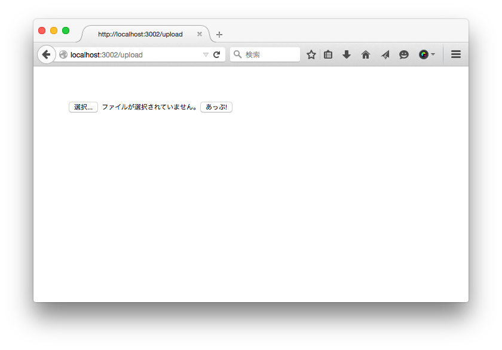

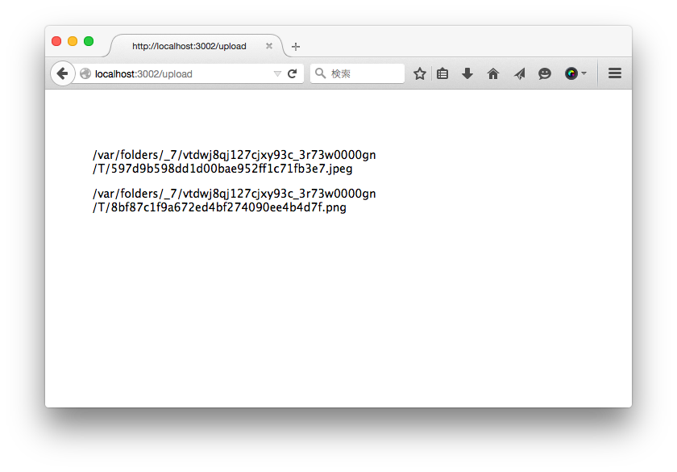

うまくアップロードされたようで、もうちょっと完成度あげってみよう：アップした画像を表示させてみる。multerの`changeDest`というオプションでファイルのアップロード先を変えることができる：

```javascript
// ./app.js

app.use(multer({
  // アップロード先を./public/imagesにする
  changeDest: function(dest, req, res) {
    return __dirname + '/public/images';
  },
  onFileUploadComplete: function(file, req, res) {
    console.log('UP完了：' + file.path);
  },

  // putSingleFilesInArrayをtureにすると、ファイル一個しか選択されても配列として扱う
  putSingleFilesInArray: true
}));
```

テンプレートの方もちょっと調整する：

```jade
// ./views/uploaded.jade

extends ./layout

block content
  for file in files
    img(src='/images/' + file.name, style="width:200px;height:auto;margin-right:2px;float:left;border:1px solid #DFDFDF;")
```

もう一回プレビューしてみよう：

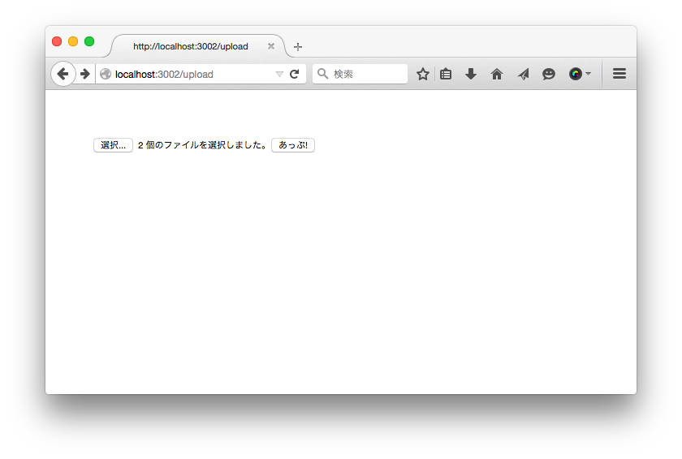

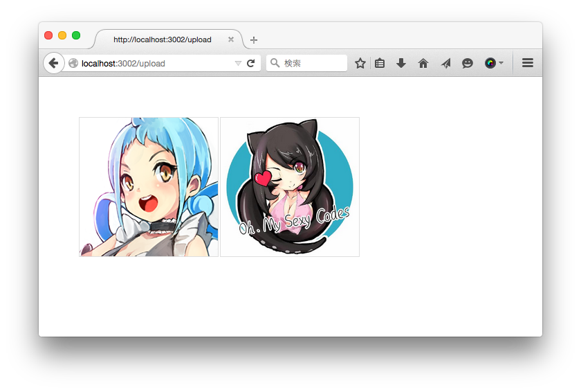

できた！これで、簡単なファイルアップロード機能が実装完了！

> この記事では最低限のファイルアップロード機能を実装したが、実際にプロダクションに移行する時に、セキュリティ面を考慮しなければならない。


## Google Cloud Storage

Google Cloud Storageを使うには、Google Cloudに登録するのが必要。詳しくはGoogle Cloudの公式サイトへ：[https://cloud.google.com/](https://cloud.google.com/)

登録完了したら、My Consoleへ、新規プロジェクト`demo`：
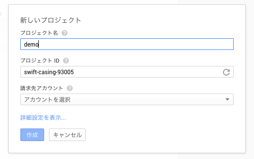

新規が完了したら、Cloud Storageのページへ。新規したプロジェクトはまだバケットがないので、下記の画面が表示される：

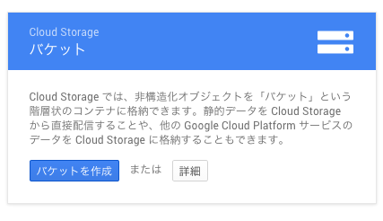

「バケットを作成」をクリックして、`upload-demo`というバケットを作成する：

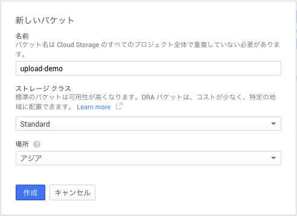


> **バケットとは？**  
> 簡単に言えば、ファイルのスコープみたいなもんで、サイトのドメインごとにバケットを作成することが多い。

自分のアプリで**Google Cloud Storageを利用するには、Google API認証用の情報が必要**。メニュー「APIと認証」の「認証情報」というページにアクセスし、「新しいクライアントIDを作成」をクリックして認証情報を作成する：

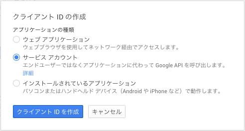

ここで、**サービスアカウント**を選んでください。作成ボタンをクリックすると情報がJSONファイルとしてダウンロードされる。

> 普段Google APIはoauth2.0で認証を行う。しかし、そのAPIを利用するのがアプリの場合は（Server to Server）、サービスアカウントのほうが直接で簡単。

## express.js + multerでGoogle Cloud Storageにファイルをアップロード

先ほどダウンロードしたJSONファイルをexpress.jsのプロジェクトディレクトリーに移して、`require`する：

```javascript
// ./app.js

var google_auth_info = require('./demo-xxxxxxxxxx');
```

Google APIの`require`も忘れずに：

```javascript
// ./app.js

var google = require('googleapis');
```

これで準備完了、まずGoogle APIの認証をしてみる：

```javascript
// ./app.js

// JWTはJSON Web Tokenの意味。
var authClient = new google.auth.JWT(
　// クライアントemail
  google_auth_info.client_email,
  null,
  // プライベートキー
  google_auth_info.private_key,
  // スコープ
  ['https://www.googleapis.com/auth/devstorage.read_write']
);

// 認証開始
var google_auth;
authClient.authorize(function(err, tokens) {
  if (err) {
    // エラーの場合は処理を中断し、エラーを表示する
    console.log(err);
    return;
  }
  google_auth = authClient;
  console.log('-- Google APIの認証通った！');
});
```

`npm start`して、認証が通った場合は、コンソールが下記のようなメッセージが表示されるはず：

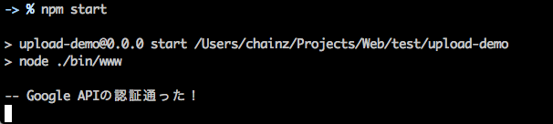

認証はちゃんと通ったので、Google APIを利用して、ファイルをGoogle Cloud Storageにアップロードする機能を実装しよう：

### multerの設定を調整する：

multerに`inMemory`オプションを追加する：

```javascript
// ./app.js

app.use(multer({
  // inMemoryをtrueにすると、アップされたfileはBuffer形式として、file.bufferに格納される。
  inMemory : true,
  onFileUploadComplete: function(file, req, res) {
    console.log('UP完了：' + file.path);
  },

  // putSingleFilesInArrayをtureにすると、ファイル一個しか選択されても配列として扱う
  putSingleFilesInArray: true
}));
```

### ルートを調整

```javascript
// ./app.js

// アップロードフォームを表示する
// + next引数追加
app.get('/upload', function(req, res, next) {
  // Google API認証まだ通ってない場合、「準備中」エラーを表示
  if (! google_auth) return next(new Error('準備中'));
  res.render('upload');
});

// アップロード処理
app.post('/upload', function(req, res) {
  // Google Cloud Storageにアップされたファイルを格納用
  var files = [];
 
  // アップされたファイル
  async.eachSeries(req.files.files, function(f, done){
    storage.objects.insert({
      // プロジェクトID
      project: 'swift-casing-93005',
      // バケット名
      bucket : 'upload-demo',
      // ファイル名
      name : f.name,
      // アクセス権限
      predefinedAcl : 'publicread',
      // ファイル情報
      media : { 
        // 中身
        body: f.buffer,
        // mimeタイプ
        mimeType : f.mimetype
      },
      // 認証情報、これがないと、エラーになる
      auth: authClient
    }, function(err, result){
        if (err) return done(err);
        console.log(result);
        // アップロード完了したら、urlを定義する
        f.url = 'https://storage.googleapis.com/upload-demo/' + f.name;
        files.push(f);
        done();
    });
  }, function(err){
    if (err) return next(err);
    res.render('uploaded', {files : files} );
  })
});
```

### テンプレート調整

```jade
// ./views/uploaded.jade

extends ./layout

block content
  for file in files
    img(src=file.url, style="width:200px;height:auto;margin-right:2px;float:left;border:1px solid #DFDFDF;")
```

これで、実装完了、早速プレビューしてみる：

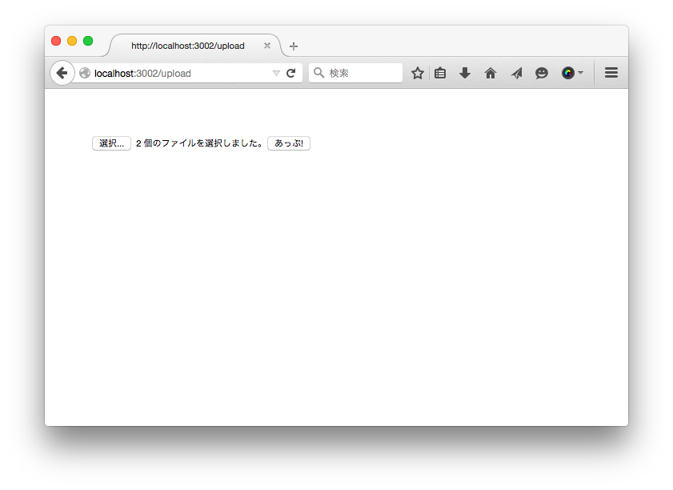

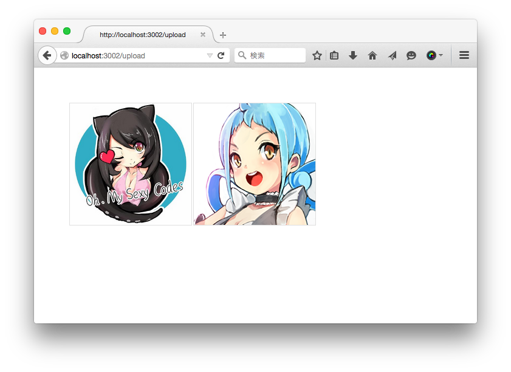

できた！
ちなみに、アップされたファイルはGoogle Cloud Consoleからも確認できる：

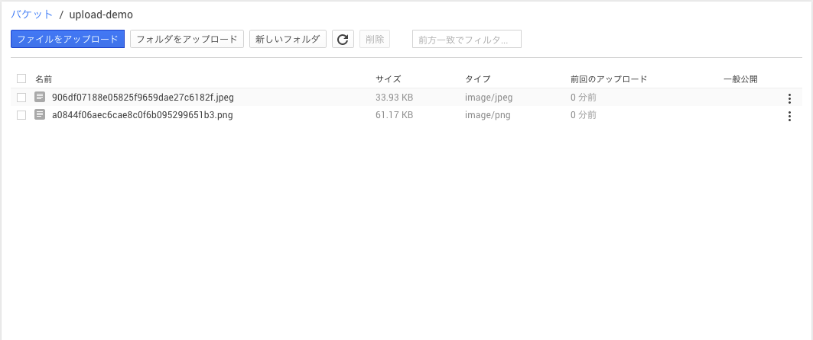

## まとめ
この記事ではexpress.jsでGoogle Cloud Storageにファイルをアップロードするアプリを作ったが、**どれも必要最低限の実装になって、実際の運用にはまだたくさんの工夫をしなければならない**。

multerは便利だが、**`inMemory`オプションをtrueしている場合は、大量のファイルを一気にアップロードすると、メモリオーバーフローエラーが出る可能性があるので、プロダクションの場合は別のアプローチを考えたのがおすすめ**。